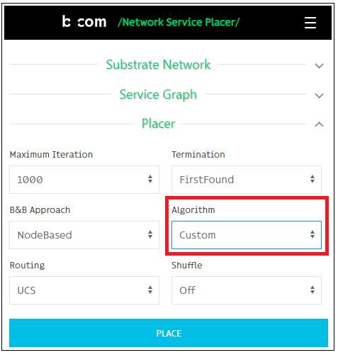

## What is this
  
This is a custom placement algorithm implementation, which can connect to our Network Sevice Placer tool to make evaluations.

## How to run
1. Build with `mvn package`
2. Run with `java -jar target/nsplacer-connect.jar`
Make sure that the connection is successfully established by receiving this message:

```
Trying to connect to wss://nsplacer.labs.b-com.com/ws...
Connection established!
```

3. Select the Custom algorithm in placer section of the nsplacer tool.

<p align="center">

</p>

4. Click place to start the evalaution

## How it works
Nsplcer-connect connects to nsplacer tool via the websocket. It waits for the placement requests from the nsplacer tool, executes a sample placement algorithm (you can implement your own placement algorithm), then replies to the server with the provided placement.

#### Placement requests
The placement request is defined on the class *CustomPlacerRequest*, and it includes the network graph (the nodes and links, with their corresponding available resources), the service graph (the nodes and links, with their corresponding required resources), and the placement parameters.

#### Placement responses
The placement response is defined on the class *CustomPlacerResponse*, and it includes 4 lists (2 lists for node placement, and the others for link placement). The *placedNetworkNodes* list contains the network node labels, over which the service graph nodes are placed, by the order which is defined in *placedServiceNodes*. The *placedPaths* list contains the network paths (a list of network link labels), over which the service graph links are placed, by the order which is defined in *placedServiceLinks*.

## About
Masoud Taghavian (masoud.taghavian@gmail.com)
